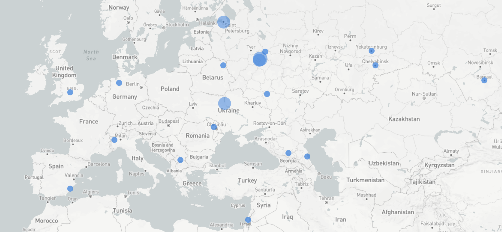

# ukraine-defense-firewall-rules

Ukraine is being attacked digitally aside from being victims of physical warfare.

[Grey Noise](https://www.greynoise.io/) has published lists of IPs that are targeting the Ukrainian IP space exclusively.

This project produces live-updating IP blocklists for common firewalls that block IPs reported by Grey Noise. Lists update every 30 minutes. Hopefully this can be useful to protect infrastructure and organisations in Ukraine from some of the ongoing digital attacks.

## Supported firewalls

* Palo Alto -> [>> files and docs here <<](./palo-alto)
* Juniper -> [>> files and docs here <<](./juniper)
* Check Point -> [>> files and docs here <<](./checkpoint)
* Cisco, pfsense, ufw, others? -> Please help out with documentation!