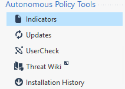
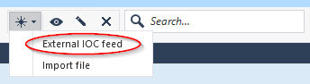

## Which IP blocklist to use

* If you want to block all non-spoofable IPs reported by [Grey Noise](https://www.greynoise.io/) to be targeting only Ukrainian IP space, use [https://api.greynoise.io/datashots/ukraine/ukraine.txt]().
* If you want to also block spoofable IPs, use [greynoise_spoofable_all.txt](https://tjclement.github.io/ukraine-defense-firewall-rules/checkpoint/greynoise_spoofable_all.txt) from this folder.
* For only IPs marked as scanning for active vulnerabilities, use `*_malicious.txt` from this folder.

## Blocking IPs on Checkpoint Gateway Version R80.30 and higher

We will be using Custom Intelligence Feeds:

### Via the Gaia Clish

Log in to the Expert mode.

Since all the lists are only a list with ip addresses.

The command is the same for every feed

ioc_feeds add --UkraineDefenceList1 ip_list --transport http --resource "https://tjclement.github.io/ukraine-defense-firewall-rules/checkpoint/greynoise_spoofable_all.txt" --format [value:1,type:ip]

To add a second feed.
ioc_feeds add --<FEED NAME> ip_list --transport http --resource "<URL OF THE FEED>" --format [value:1,type:ip]

#### Interval
The default update interval is 300 seconds

Use ioc_feeds show_interval to see the interval.
	Feeds will be fetched every 300 seconds

Use ioc_feeds set_interval <Seconds> to set the fetch interval.

### Via web interface

From the left navigation panel, click Security Policies.
In the top left section, click Threat Prevention > Policy.
In the bottom left section, click Threat Tools.

Click Indicators.
Click New and select External IOC feed.

The Indicator feed configuration window opens.

Enter these details:

Feed name - Each indicator must have a unique name.

Enter the Feed URL

Select an Action for this Indicator. We use prevent
	Prevent - Threat Prevention Software Blade blocks the detected observable
	Detect - Threat Prevention Software Blade creates a log entry, and lets the detected observable go through

Select Use custom feed settings

Type: IP Address

Fielse to column number mappings
Value: 1

Leave te rest empty/

Click Test Connectivity to check if the feed runs properly.

Click OK.

The new indicator shows in the Indicators page.

