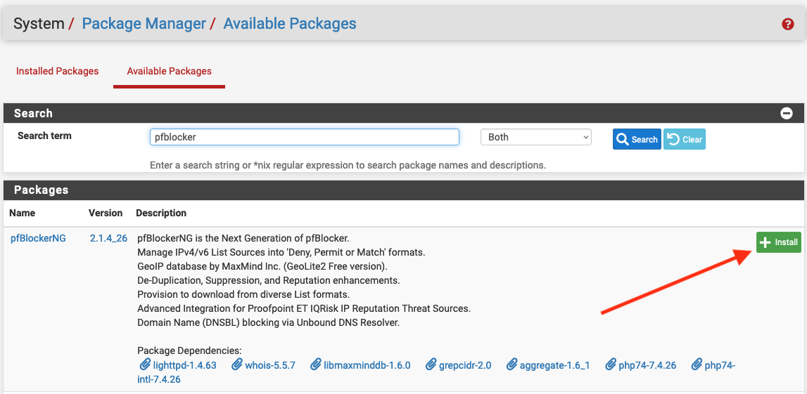
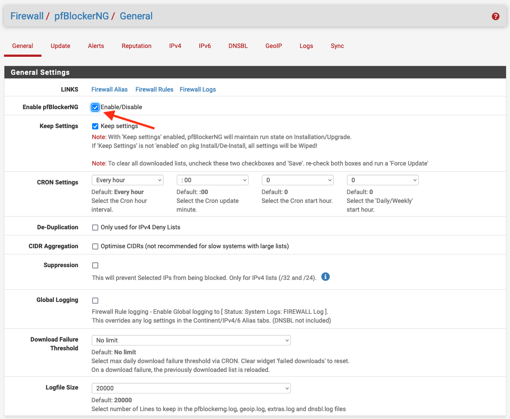
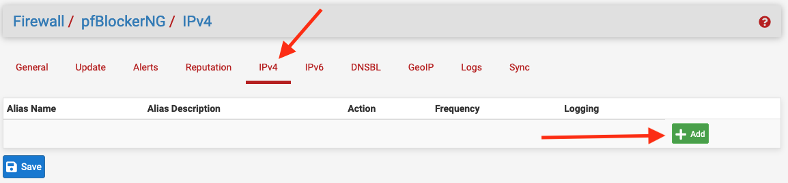
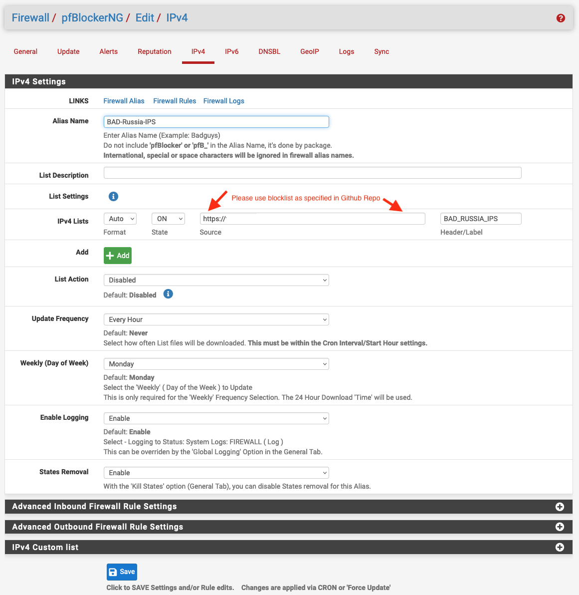
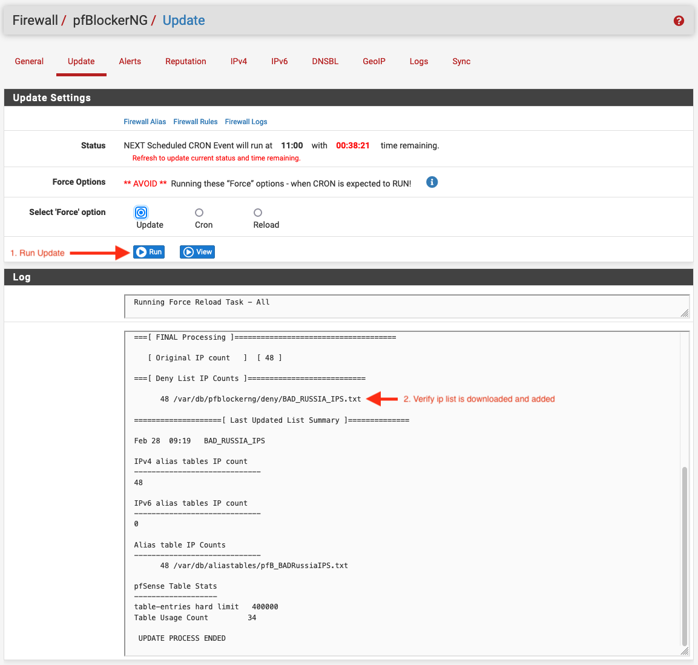
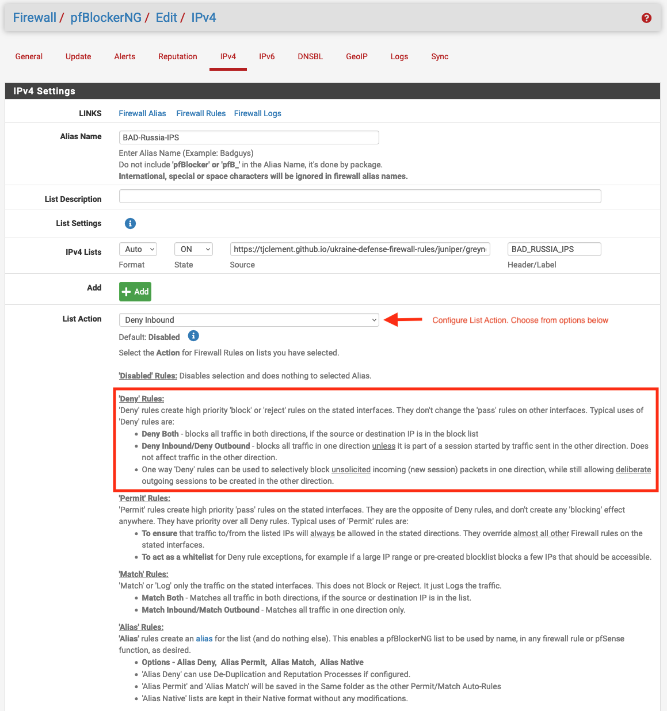

## Which IP blocklist to use

* If you want to block all non-spoofable IPs reported by [Grey Noise](https://www.greynoise.io/) to be targeting only Ukrainian IP space, use [https://api.greynoise.io/datashots/ukraine/ukraine.txt](https://api.greynoise.io/datashots/ukraine/ukraine.txt).
* If you want to also block spoofable IPs, use [greynoise_spoofable_all.txt](https://tjclement.github.io/ukraine-defense-firewall-rules/pfsense/greynoise_spoofable_all.txt) from this folder.
* For only IPs marked as scanning for active vulnerabilities, use `*_malicious.txt` from this folder.

## Blocking IPs on pfSense firewalls

Blocking IPs from dynamic blocklists in pfSense can be done through the `pfBlockerNG` package. Here's how to set it up:

